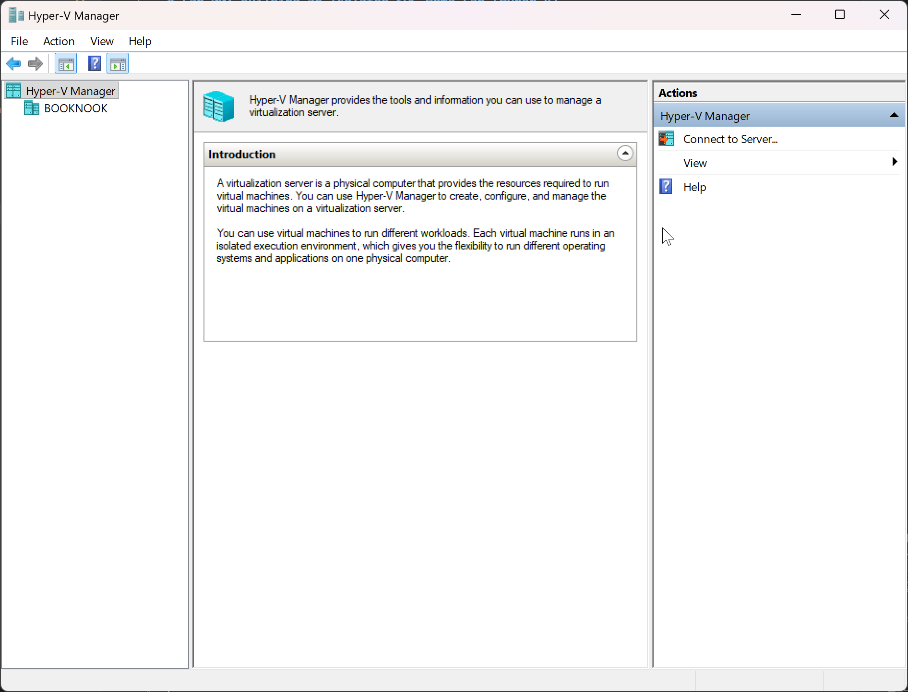
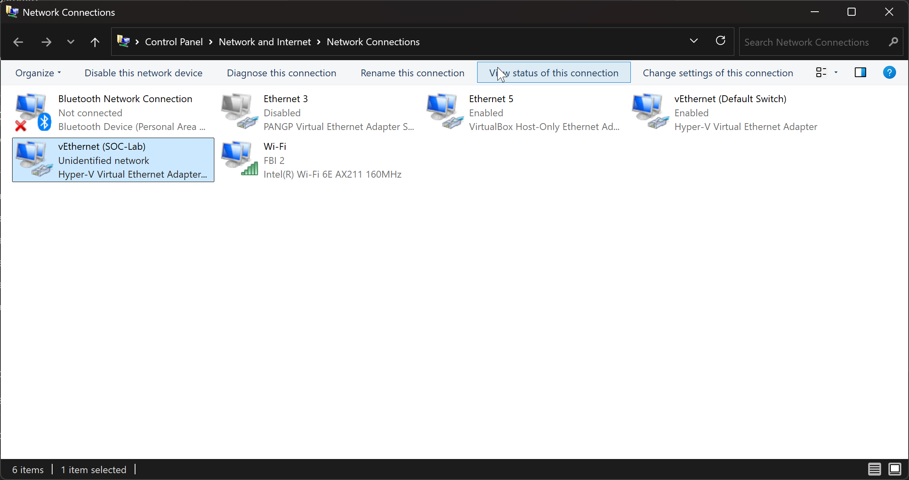
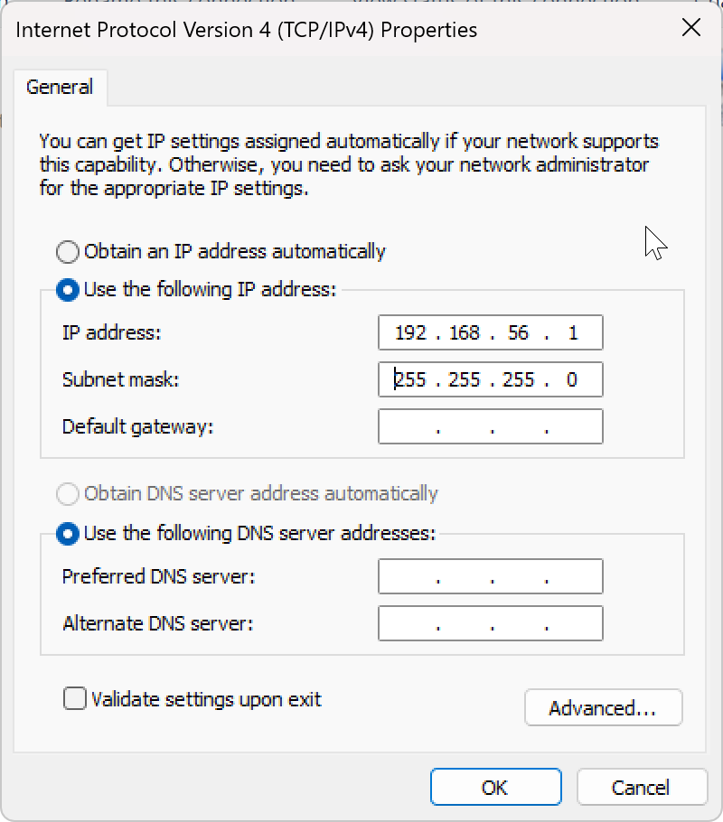

# Lab 00: Building an Isolated SOC Home Lab (Hyper-V)

> Standing up a safe, self-contained virtual network of an attacker, a victim endpoint, and a SIEM — the foundation every other lab in this series runs on.

**Domain:** Foundation / Lab Infrastructure
**Tools:** Hyper-V, Kali Linux, Windows 11 Enterprise (eval), Ubuntu Server
**MITRE ATT&CK:** N/A (environment setup)
**Date:** _fill in_

---

## Objective

Build a fully isolated virtual lab where I can safely run offensive tools against machines I own, generate realistic security telemetry, and analyze it — without any risk to my home network or the internet. This environment is the base for all subsequent SIEM, detection, network, and threat-intel labs.

## Why Hyper-V (and not VirtualBox)

This lab runs on **Hyper-V**, Windows' built-in type-1 hypervisor. The practical reason: Windows 11's security stack (Virtualization-Based Security / Memory Integrity) keeps the hypervisor resident, and other virtualization tools like VirtualBox can only run *on top of* it through a slower compatibility layer — which is unstable for a Windows 11 guest and tends to black-screen. Running the lab natively in Hyper-V sidesteps that entirely: Windows 11 boots reliably (Secure Boot, TPM, and display all work natively), and Hyper-V coexists with anything else that needs the hypervisor with no reboots or mode-switching.

## Why isolation matters (and what employers read into it)

Every action in these labs — running attacks, detonating suspicious traffic, misconfiguring services — stays inside a private virtual switch with no route to the internet or my real LAN. Designing that boundary *before* touching any tools is itself the security mindset a SOC wants to see. When I write this up, "I built a segmented, isolated lab and checkpoint before every risky change" signals good judgment as much as any tool skill.

## Target architecture

```
        ┌─────────────────────────────────────────────┐
        │   Hyper-V Internal switch "SOC-Lab"          │
        │        (192.168.56.0/24)                     │
        │        — no internet, no home LAN —          │
        │                                              │
        │   ┌──────────┐   ┌───────────┐   ┌────────┐  │
        │   │  Kali    │   │ Windows11 │   │ Ubuntu │  │
        │   │ attacker │   │  victim   │   │  SIEM  │  │
        │   │ .10      │   │  .20      │   │  .30   │  │
        │   └──────────┘   └───────────┘   └────────┘  │
        │        Windows host vEthernet = .1           │
        └─────────────────────────────────────────────┘
```

*(Screenshot to capture: your final network diagram — draw it in draw.io and export a PNG for this section.)*

## Prerequisites

- **Windows 11 Pro, Enterprise, or Education** on the host. Hyper-V is not available on Windows Home.
- A host machine with **16 GB RAM minimum** (32 GB is comfortable) and ~150 GB free disk. You'll run 2–3 VMs at once.
- CPU virtualization enabled in BIOS/UEFI (Intel VT-x or AMD-V).

## Step 1 — Enable Hyper-V

1. Open **Turn Windows features on or off**, check **Hyper-V** (both *Management Tools* and *Platform*), and reboot. (Or run the provided `Enable-HyperV-Full.bat`, which does this and sets the hypervisor to launch at boot.)
2. After reboot, launch **Hyper-V Manager** from the Start menu and confirm it opens and lists your host.


*(Screenshot: Hyper-V Manager open, showing the local host.)*

## Step 2 — Create the isolated virtual switch

This is the most important step. You'll create an **Internal** virtual switch, which lets your VMs talk to each other and to the host, but never to the internet or your real network. (Choose **Private** instead if you want the VMs isolated even from the host.)

1. In Hyper-V Manager: **Virtual Switch Manager → New virtual network switch → Internal → Create Virtual Switch**.
2. Name it `SOC-Lab`. Leave connection type **Internal network**. Apply.
3. On the host, this creates a `vEthernet (SOC-Lab)` adapter. Give it a static IP so the host sits on the lab network: open **Settings → Network & internet → Advanced network settings → vEthernet (SOC-Lab) → Edit IP assignment**, set **Manual**, IPv4 `192.168.56.1`, mask `255.255.255.0`, no gateway.


*(Screenshot: Virtual Switch Manager showing the SOC-Lab Internal switch.)*

> **Why Internal, not External:** an External switch bridges to your physical NIC and the internet — the opposite of what we want. Internal keeps everything contained while still letting you reach the Splunk web UI from your host browser.


*(Screenshot: IP address assigned to the SOC-Lab virtual switch.)*

## Step 3 — Build the attacker: Kali Linux

1. Download the **Kali Linux installer ISO** (or the prebuilt Hyper-V image) from kali.org.
2. In Hyper-V Manager: **New → Virtual Machine**. Choose **Generation 2**, 2+ vCPU, 4 GB RAM, 40 GB disk. Attach the Kali ISO, and connect the network adapter to the **SOC-Lab** switch.
3. **Important for Linux on Gen 2:** open the VM's **Settings → Security** and either uncheck **Enable Secure Boot** or set the template to **Microsoft UEFI Certificate Authority**, or Kali won't boot.
4. Install Kali, log in, and assign a static IP `192.168.56.10` (via the network settings or `/etc/network/interfaces`).

*(Screenshot: Kali desktop + `ip a` output showing .10.)*

## Step 4 — Build the victim: Windows 11 Enterprise (evaluation)

Microsoft publishes a **free Windows 11 Enterprise 90-day evaluation** — perfect for generating realistic Windows security logs, and it runs natively on Hyper-V.

1. Download the Windows 11 Enterprise **evaluation ISO** from the Microsoft Evaluation Center (no product key required).
2. In Hyper-V Manager: **New → Virtual Machine**. Choose **Generation 2**, 2+ vCPU, 4 GB RAM, 60 GB disk. Attach the Windows 11 ISO and connect the adapter to **SOC-Lab**.
3. Windows 11 requires TPM and Secure Boot — both are native on Gen 2. In the VM's **Settings → Security**, confirm **Enable Secure Boot** is checked and **Enable Trusted Platform Module** is checked.
4. Install Windows, assign IP `192.168.56.20`.
5. Confirm it boots to the desktop. (After 90 days the eval expires and the desktop turns black / shuts down hourly — just re-download when that happens.)

> Take a clean **checkpoint** early so you can always roll back to a fresh state.

*(Screenshot: Windows 11 desktop + `ipconfig` showing .20.)*

## Step 5 — Build the SIEM host: Ubuntu Server

1. Download the **Ubuntu Server LTS** ISO from ubuntu.com. Create a new **Generation 2** VM (2 vCPU, 4 GB RAM min, 40 GB disk), connect to **SOC-Lab**.
2. As with Kali, adjust **Security → Secure Boot** (Microsoft UEFI CA template, or disabled) so the installer boots.
3. Install Ubuntu (minimal server), assign IP `192.168.56.30`.

This VM will host Splunk in **Lab 01**.

*(Screenshot: Ubuntu login + `ip a` showing .30.)*

## Step 6 — Temporary internet for updates, then lock it down

The SOC-Lab switch has no internet by design. To install updates and tools, temporarily give each VM a second adapter with internet, then remove it:

1. With the VM off, **Settings → Add Hardware → Network Adapter → connect it to the "Default Switch"** (Hyper-V's built-in NAT switch with internet).
2. Boot, run your updates: Kali/Ubuntu `sudo apt update && sudo apt upgrade -y`; Windows Update as needed. Download Splunk/tools now.
3. Shut down and **remove that second adapter**, leaving only the SOC-Lab adapter. Do all attacking with internet OFF.

## Step 7 — Verify connectivity and isolation

1. From Kali, ping the other two: `ping 192.168.56.20` and `ping 192.168.56.30`. (Allow ICMP through the Windows firewall for the ping test.)
2. From the host, confirm you can reach the VMs on `192.168.56.x` (this is why we used an Internal switch).
3. Confirm **none** of the VMs can reach the internet: `ping 8.8.8.8` should fail. If it succeeds, you still have the Default Switch adapter attached — remove it.

*(Screenshot: successful internal ping + failed external ping — this is your proof of isolation.)*

## Step 8 — Checkpoint everything

For each VM: **right-click → Checkpoint**, name it `clean-baseline`. From now on, checkpoint before every lab and roll back after. This is what makes your labs reproducible and your screenshots repeatable.

> Tip: Hyper-V uses **production checkpoints** by default (application-consistent). That's fine here. For a snapshot that captures exact running memory state, switch the VM to **standard checkpoints** in its settings.

## Findings / result

| Machine | Role | IP | State |
|---------|------|-----|-------|
| Kali | Attacker | 192.168.56.10 | Clean baseline checkpoint |
| Windows 11 | Victim endpoint | 192.168.56.20 | Clean baseline checkpoint |
| Ubuntu Server | SIEM host | 192.168.56.30 | Clean baseline checkpoint |
| Windows host | Lab management | 192.168.56.1 | vEthernet on SOC-Lab switch |

A three-machine, internal-switch lab with confirmed internal connectivity and confirmed internet isolation.

## Lessons learned

When setting this up, I learned that it's important to plan the network topology carefully to ensure proper isolation and connectivity. Also, managing and maintaining the virtual environment requires attention to detail and a good understanding of the tools involved. Claude had a hard time with my other projects because I had to disable its hypervisor. I switched to windows 11 Education which has better support for virtualization and now both can run in unison. 

## References

- Splunk Free license (500 MB/day): https://help.splunk.com/en/splunk-enterprise/administer/admin-manual/10.4/configure-splunk-licenses/about-splunk-free
- Windows 11 Enterprise evaluation (90 days): https://www.microsoft.com/en-us/evalcenter/evaluate-windows-11-enterprise
- Hyper-V on Windows 11: https://learn.microsoft.com/en-us/virtualization/hyper-v-on-windows/
- Create a virtual switch for Hyper-V: https://learn.microsoft.com/en-us/windows-server/virtualization/hyper-v/get-started/create-a-virtual-switch-for-hyper-v-virtual-machines
- Kali Linux (Hyper-V / ISO images): https://www.kali.org/get-kali/
