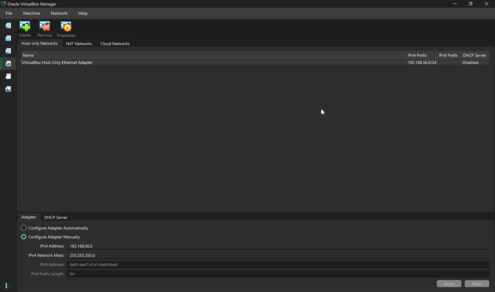
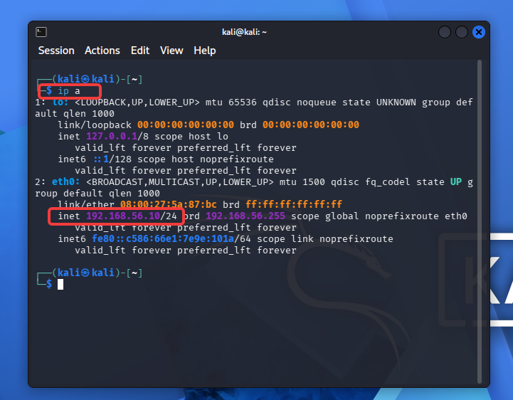

# Lab 00: Building an Isolated SOC Home Lab

> Standing up a safe, self-contained virtual network of an attacker, a victim endpoint, and a SIEM — the foundation every other lab in this series runs on.

**Domain:** Foundation / Lab Infrastructure
**Tools:** VirtualBox, Kali Linux, Windows 11 Enterprise (eval), Ubuntu Server
**MITRE ATT&CK:** N/A (environment setup)
**Date:** _fill in_

---

## Objective

Build a fully isolated virtual lab where I can safely run offensive tools against machines I own, generate realistic security telemetry, and analyze it — without any risk to my home network or the internet. This environment is the base for all subsequent SIEM, detection, network, and threat-intel labs.

## Why isolation matters (and what employers read into it)

Every action in these labs — running attacks, detonating suspicious traffic, misconfiguring services — stays inside a private virtual network with no route to the internet or my real LAN. Designing that boundary *before* touching any tools is itself the security mindset a SOC wants to see. When I write this up, "I built a segmented, host-only lab and snapshot before every risky change" signals good judgment as much as any tool skill.

## Target architecture

```
        ┌─────────────────────────────────────────────┐
        │        Host-only network (192.168.56.0/24)  │
        │              — no internet, no home LAN —    │
        │                                              │
        │   ┌──────────┐   ┌───────────┐   ┌────────┐  │
        │   │  Kali    │   │ Windows11 │   │ Ubuntu │  │
        │   │ attacker │   │  victim   │   │  SIEM  │  │
        │   │ .10      │   │  .20      │   │  .30   │  │
        │   └──────────┘   └───────────┘   └────────┘  │
        └─────────────────────────────────────────────┘
```

*(Screenshot to capture: your final network diagram — draw it in draw.io and export a PNG for this section.)*

## Prerequisites

- A host machine with **16 GB RAM minimum** (32 GB is comfortable) and ~150 GB free disk. You'll run 2–3 VMs at once.
- CPU virtualization enabled in BIOS/UEFI (Intel VT-x or AMD-V).

## Step 1 — Install VirtualBox

1. Download **VirtualBox** and the matching **Extension Pack** from virtualbox.org.
2. Install both (the Extension Pack adds USB and other device support).
3. Verify it launches and shows the VirtualBox Manager.

## Step 2 — Create the isolated network

This is the most important step. You'll use a **Host-only network**, which lets your VMs talk to each other and (optionally) to your host, but never to the internet or your real network.

1. In VirtualBox: **Tools → Network → Host-only Networks → Create**.
2. Note the network address it assigns (commonly `192.168.56.0/24`). Disable its DHCP server if you want to assign static IPs manually (recommended, so IPs stay stable across your writeups).



*VirtualBox Manager — host-only network `192.168.56.0/24` created with DHCP disabled and a manually configured adapter.*

> **Tip:** During initial VM installs you may temporarily attach a NAT adapter to download updates/tools, then **remove it** and leave only the host-only adapter for lab work. Do your attacking with internet access OFF.

## Step 3 — Build the attacker: Kali Linux

1. Download the **Kali Linux VirtualBox image** (pre-built .vbox/.ova) from kali.org. Import it via **File → Import Appliance**.
2. Set its network adapter to your **host-only** network.
3. Boot, log in (default creds `kali` / `kali`), and change the password.
4. Assign a static IP `192.168.56.10` (via the network settings or `/etc/network/interfaces`).



## Step 4 — Build the victim: Windows 11 Enterprise (evaluation)

Microsoft publishes **free Windows 11 Enterprise evaluation VMs that officially support VirtualBox**, valid for 90 days — perfect for generating realistic Windows security logs.

1. Download the Windows 11 Enterprise **evaluation VM image for VirtualBox** from the Microsoft Evaluation Center (no product key required), or install from the 90-day eval ISO.
2. Import it, set its adapter to **host-only**, assign IP `192.168.56.20`.
3. Log in and confirm it boots. (After 90 days the eval expires and shuts down hourly — just rebuild or re-download when that happens.)

> Note: the eval VM turns the desktop black and shuts down hourly once expired. Take a clean snapshot early so you can always roll back to a fresh state.

*(Screenshot: Windows 11 desktop + `ipconfig` showing .20.)*

## Step 5 — Build the SIEM host: Ubuntu Server

1. Download the **Ubuntu Server LTS** ISO from ubuntu.com. Create a new VM (2 vCPU, 4 GB RAM min, 40 GB disk).
2. Install Ubuntu (minimal server). Set adapter to **host-only**, assign IP `192.168.56.30`.
3. Update: `sudo apt update && sudo apt upgrade -y` (do this with NAT temporarily attached, then remove it).

This VM will host Splunk in **Lab 01**.

*(Screenshot: Ubuntu login + `ip a` showing .30.)*

## Step 6 — Verify connectivity and lock it down

1. From Kali, ping the other two: `ping 192.168.56.20` and `ping 192.168.56.30`. (You may need to allow ICMP through the Windows firewall for the ping test.)
2. Confirm **none** of the VMs can reach the internet: `ping 8.8.8.8` should fail. If it succeeds, you still have a NAT/bridged adapter attached — remove it.

*(Screenshot: successful internal ping + failed external ping — this is your proof of isolation.)*

## Step 7 — Snapshot everything

For each VM: **right-click → Snapshot → Take**, name it `clean-baseline`. From now on, snapshot before every lab and roll back after. This is what makes your labs reproducible and your screenshots repeatable.

## Findings / result

| Machine | Role | IP | State |
|---------|------|-----|-------|
| Kali | Attacker | 192.168.56.10 | Clean baseline snapshot |
| Windows 11 | Victim endpoint | 192.168.56.20 | Clean baseline snapshot |
| Ubuntu Server | SIEM host | 192.168.56.30 | Clean baseline snapshot |

A three-machine, host-only lab with confirmed internal connectivity and confirmed internet isolation.

## Lessons learned

_Fill in as you go — e.g., a networking gotcha you hit, why you chose static IPs, how snapshots saved you._

## References

- Splunk Free license (500 MB/day): https://help.splunk.com/en/splunk-enterprise/administer/admin-manual/10.4/configure-splunk-licenses/about-splunk-free
- Windows 11 Enterprise evaluation (VirtualBox images, 90 days): https://www.microsoft.com/en-us/evalcenter/evaluate-windows-11-enterprise
- VirtualBox: https://www.virtualbox.org
- Kali Linux VM images: https://www.kali.org/get-kali/#kali-virtual-machines
