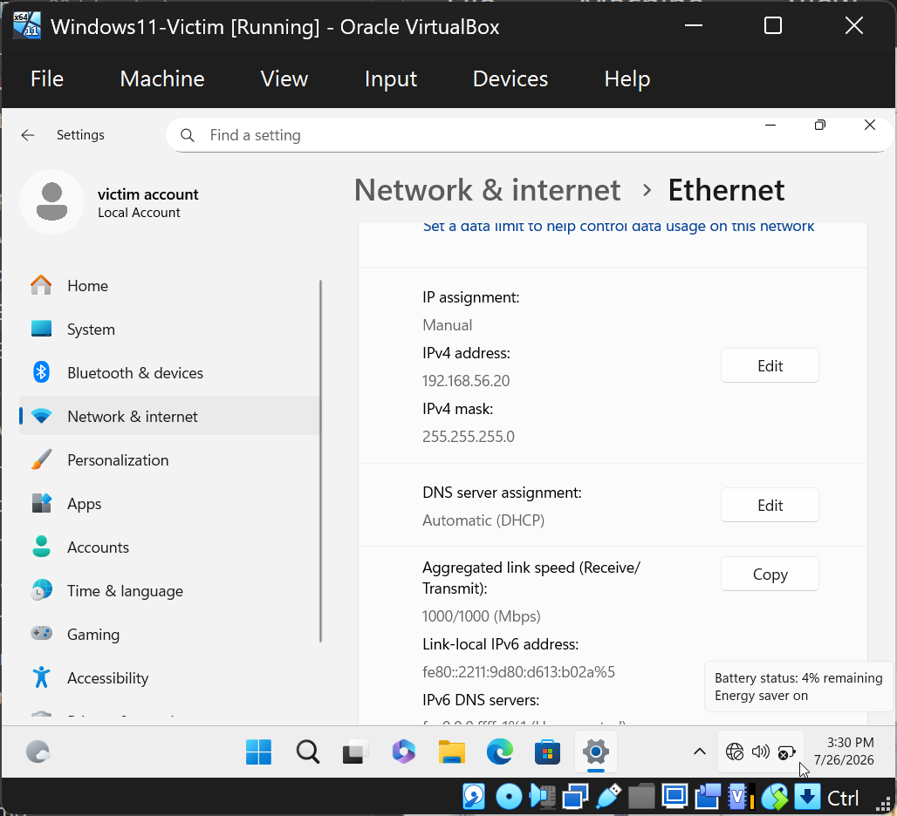

# Lab 00: Building an Isolated SOC Home Lab

> Standing up a safe, self-contained virtual network of an attacker, a victim endpoint, and a SIEM — the foundation every other lab in this series runs on.

**Domain:** Foundation / Lab Infrastructure
**Tools:** VirtualBox, Kali Linux, Windows 11 Enterprise (eval), Ubuntu Server
**MITRE ATT&CK:** N/A (environment setup)
**Date:** _fill in_

---

## Objective

Build a fully isolated virtual lab where I can safely run offensive tools against machines I own, generate realistic security telemetry, and analyze it — without any risk to my home network or the internet. This environment is the base for all subsequent SIEM, detection, network, and threat-intel labs.

## Why isolation matters (and what employers read into it)

Every action in these labs — running attacks, detonating suspicious traffic, misconfiguring services — stays inside a private virtual network with no route to the internet or my real LAN. Designing that boundary *before* touching any tools is itself the security mindset a SOC wants to see. When I write this up, "I built a segmented, host-only lab and snapshot before every risky change" signals good judgment as much as any tool skill.

## Target architecture

```
        ┌─────────────────────────────────────────────┐
        │        Host-only network (192.168.56.0/24)  │
        │              — no internet, no home LAN —    │
        │                                              │
        │   ┌──────────┐   ┌───────────┐   ┌────────┐  │
        │   │  Kali    │   │ Windows11 │   │ Ubuntu │  │
        │   │ attacker │   │  victim   │   │  SIEM  │  │
        │   │ .10      │   │  .20      │   │  .30   │  │
        │   └──────────┘   └───────────┘   └────────┘  │
        └─────────────────────────────────────────────┘
```

*(Screenshot to capture: your final network diagram — draw it in draw.io and export a PNG for this section.)*

## Prerequisites

- A host machine with **16 GB RAM minimum** (32 GB is comfortable) and ~150 GB free disk. You'll run 2–3 VMs at once.
- CPU virtualization enabled in BIOS/UEFI (Intel VT-x or AMD-V).

## Step 1 — Install VirtualBox

1. Download **VirtualBox** and the matching **Extension Pack** from virtualbox.org.
2. Install both (the Extension Pack adds USB and other device support).
3. Verify it launches and shows the VirtualBox Manager.

## Step 2 — Create the isolated network

This is the most important step. You'll use a **Host-only network**, which lets your VMs talk to each other and (optionally) to your host, but never to the internet or your real network.

1. In VirtualBox: **Tools → Network → Host-only Networks → Create**.
2. Note the network address it assigns (commonly `192.168.56.0/24`). Disable its DHCP server if you want to assign static IPs manually (recommended, so IPs stay stable across your writeups).


*VirtualBox Manager — host-only network `192.168.56.0/24` created with DHCP disabled and a manually configured adapter.*

> **Tip:** During initial VM installs you may temporarily attach a NAT adapter to download updates/tools, then **remove it** and leave only the host-only adapter for lab work. Do your attacking with internet access OFF.

## Step 3 — Build the attacker: Kali Linux

1. Download the **Kali Linux VirtualBox image** (pre-built .vbox/.ova) from kali.org. Import it via **File → Import Appliance**.
2. Set its network adapter to your **host-only** network.
3. Boot, log in (default creds `kali` / `kali`), and change the password.
4. Assign a static IP `192.168.56.10` (via the network settings or `/etc/network/interfaces`).


## Step 4 — Build the victim: Windows 11 Enterprise (evaluation)

Microsoft publishes **free Windows 11 Enterprise evaluation VMs that officially support VirtualBox**, valid for 90 days — perfect for generating realistic Windows security logs.

1. Download the Windows 11 Enterprise **evaluation VM image for VirtualBox** from the Microsoft Evaluation Center (no product key required), or install from the 90-day eval ISO.
2. Import it, set its adapter to **host-only**, assign IP `192.168.56.20`.
3. Log in and confirm it boots. (After 90 days the eval expires and shuts down hourly — just rebuild or re-download when that happens.)

> Note: the eval VM turns the desktop black and shuts down hourly once expired. Take a clean snapshot early so you can always roll back to a fresh state.



> If installing from the eval **ISO** instead of a pre-built image: create a new VM (EFI + TPM 2.0 enabled for Windows 11), attach the ISO, and install normally — choose **"I don't have a product key"** and the **Enterprise Evaluation** edition (90 days free).

### Assigning the static IP (Windows 11)

**In VirtualBox first** — put the VM on the isolated network: power off the VM → **Settings → Network → Adapter 1 → Attached to: Host-only Adapter**, select the `192.168.56.x` network → **OK** → boot. (Optionally enable Adapter 2 as NAT if you need internet inside Windows to download tools later.)

**Inside Windows** — set the address:

1. **Start → Settings → Network & Internet → Ethernet.**
2. Click the Ethernet connection to expand it, find **IP assignment**, click **Edit**.
3. Change **Automatic (DHCP)** to **Manual**, toggle **IPv4** to **On**, and enter:
   - IP address: `192.168.56.20`
   - Subnet mask / prefix length: `255.255.255.0` (or `24`)
   - Gateway: **blank**, DNS: **blank** (host-only has no internet route)
4. **Save.**

*Classic alternative:* `Win+R` → `ncpa.cpl` → right-click **Ethernet → Properties → Internet Protocol Version 4 (TCP/IPv4) → Properties → Use the following IP address** → `192.168.56.20` / `255.255.255.0`, gateway blank → OK.

**Verify:** open Command Prompt → `ipconfig` → confirm `IPv4 Address . . . : 192.168.56.20`.

**Allow ping for connectivity tests** — Windows Firewall blocks ICMP by default, so pings from Kali will fail until you add a rule. In an **admin** Command Prompt on the Windows VM:

```
netsh advfirewall firewall add rule name="Allow ICMPv4-In" protocol=icmpv4:8,any dir=in action=allow
```

Then `ping 192.168.56.20` from Kali should succeed.

## Step 5 — Build the SIEM host: Ubuntu Server

This VM hosts Splunk in **Lab 01**. It's special because it needs *both* the isolated lab network (to receive logs) and internet (to download Splunk and updates) — so it gets two adapters.

**Download:** the latest **Ubuntu Server LTS** ISO from ubuntu.com (~2–3 GB).

**Create the VM:** VirtualBox → New → name `Ubuntu-SIEM`, attach the ISO, check *Skip Unattended Installation*. 4096 MB RAM, 2 CPUs, 40 GB disk.

**Two network adapters** (Settings → Network):

- **Adapter 1:** Host-only Adapter, the `192.168.56.x` network → becomes `enp0s3` (lab-facing).
- **Adapter 2:** enable, NAT → becomes `enp0s8` (internet).

**Install Ubuntu:** boot the VM → *Try or Install Ubuntu Server*. Language/keyboard → leave both NICs on DHCP for now → default storage (whole disk) → set username/password (**no default login here**) → **check "Install OpenSSH server"** (lets you SSH in from the host, where copy/paste works) → skip snaps → reboot.

**Set the static IP (netplan):** Ubuntu Server uses netplan, not a GUI. After login:

```bash
ip a                    # find interface names (enp0s3 = host-only, enp0s8 = NAT)
sudo nano /etc/netplan/50-cloud-init.yaml
```

Make it read exactly (2 spaces per indent, no tabs):

```yaml
network:
  version: 2
  ethernets:
    enp0s3:
      dhcp4: no
      addresses: [192.168.56.30/24]
    enp0s8:
      dhcp4: yes
```

Save (Ctrl+O, Enter), exit (Ctrl+X), then apply:

```bash
sudo netplan apply
ip a                    # confirm enp0s3 = 192.168.56.30
```

**Update:**

```bash
sudo apt update && sudo apt upgrade -y
```

> **Tip — SSH in for copy/paste:** the server console has no clipboard sharing. Either SSH from the host over host-only (`ssh user@192.168.56.30`) once the static IP is set, or add a NAT port-forward (Adapter 2 → Advanced → Port Forwarding: host 2222 → guest 22) and `ssh user@127.0.0.1 -p 2222`. Pasting works in the host terminal.

**Verify both networks:**

```bash
ping -c3 192.168.56.20   # lab connectivity to the Windows victim
ping -c3 8.8.8.8         # internet via NAT (needed to download Splunk)
```

*(Screenshot: Ubuntu login + `ip a` showing .30, plus both pings succeeding.)*

## Step 6 — Verify connectivity and lock it down

1. From Kali, ping the other two: `ping 192.168.56.20` and `ping 192.168.56.30`. (You may need to allow ICMP through the Windows firewall for the ping test.)
2. Confirm **none** of the VMs can reach the internet: `ping 8.8.8.8` should fail. If it succeeds, you still have a NAT/bridged adapter attached — remove it.

*(Screenshot: successful internal ping + failed external ping — this is your proof of isolation.)*

## Step 7 — Snapshot everything

For each VM: **right-click → Snapshot → Take**, name it `clean-baseline`. From now on, snapshot before every lab and roll back after. This is what makes your labs reproducible and your screenshots repeatable.

## Troubleshooting: VBS / Hyper-V black screen (green turtle)

The most common blocker when building this lab on a Windows 11 host: a VM (Windows 11 victim especially) boots to a **black screen** and VirtualBox shows a small **green turtle** icon in the status bar. The turtle means VirtualBox couldn't get hardware virtualization and fell back to slow software emulation — because **Windows' own hypervisor is holding the virtualization hardware**. VirtualBox (hardware-accelerated) and the Windows hypervisor can't both own it at once.

**Root causes, in order of likelihood**

1. **Hyper-V / related Windows features enabled.** Turn off in *"Turn Windows features on or off"*: Hyper-V, Windows Hypervisor Platform, Virtual Machine Platform, Windows Subsystem for Linux. Reboot.
2. **Hypervisor still launching at boot.** In an **admin** prompt: `bcdedit /set hypervisorlaunchtype off` then reboot.
3. **Core Isolation / Memory Integrity on.** Windows Security → Device Security → Core isolation → Memory Integrity → Off. Reboot.
4. **Virtualization-Based Security (VBS) enabled, often with a UEFI lock** (frequently on by default on Windows 11). Check with `msinfo32` → *Virtualization-based security*. If it says **Running** after the steps above, clear it with Microsoft's **Device Guard and Credential Guard hardware readiness tool**:
   ```powershell
   Set-ExecutionPolicy -Scope Process -ExecutionPolicy Bypass
   cd <folder containing the tool>
   .\DG_Readiness_Tool_v3.6.ps1 -Disable
   ```
   Reboot, and **watch for a firmware prompt during startup** to confirm disabling the security feature — press the key it names, or VBS stays locked on. After reboot, `msinfo32` should read *Not enabled*.
5. **VT-x/AMD-V disabled in BIOS/UEFI.** Enable Intel VT-x / AMD-V (a.k.a. SVM Mode) in firmware. (If a VM is already running with hardware accel, this is fine.)

**Verify the fix:** `bcdedit /enum {current}` should show `hypervisorlaunchtype   Off`, and the green turtle should be gone from the running VM's status bar.

### Trade-off: hypervisor off vs. WSL2 / other hypervisor apps

Disabling the hypervisor to run VirtualBox at full speed also disables anything that relies on it — **WSL2, Docker (WSL2 backend), Windows Sandbox, Hyper-V VMs**. It's an either/or per boot. Switch sides with:

- Hypervisor **off** (fast VirtualBox lab): `bcdedit /set hypervisorlaunchtype off` + reboot
- Hypervisor **on** (WSL2 / Hyper-V / Sandbox): `bcdedit /set hypervisorlaunchtype auto` + reboot

To avoid typing each time, create a **dual-boot menu entry** so you pick at startup:
```
bcdedit /copy {current} /d "Windows 11 - Lab (VirtualBox)"
bcdedit /set {new-guid-printed-above} hypervisorlaunchtype off
bcdedit /set {current} hypervisorlaunchtype auto
bcdedit /timeout 10
```
Then choose the "Lab (VirtualBox)" entry at boot for lab work, or the default entry for WSL2/Hyper-V. Switching still requires a reboot — that's inherent to how Windows shares the virtualization hardware.

## Troubleshooting: VMs can't ping each other

Symptoms and their real causes, from the sender's point of view:

- **"Network is unreachable"** — the *sending* VM has no IP on `192.168.56.0/24`. Its adapter is on NAT/"Not attached", or the static IP never applied. Fix the sender's adapter/IP first.
- **"Destination host unreachable"** + `ip neigh` shows the target as `FAILED` — the sender is on the subnet but gets no ARP reply. The two machines aren't actually on the same segment, or the target is down. Check, in order:
  1. **Target VM is powered on** and holds the right IP (`ipconfig` / `ip a`).
  2. **Both VMs' Adapter 1 point to the *identical* host-only network name** (VirtualBox can have several — `...Adapter`, `...Adapter #2`; mismatched ones are isolated from each other).
  3. **The virtual cable is connected.** Settings → Network → Adapter 1 → Advanced → **Cable Connected** must be checked. An unplugged virtual cable gives correct IPs on both ends but no ARP reply — exactly a `FAILED` neighbor entry.
- **"Request timed out"** (not "host unreachable") — layer-2 is fine; this is usually the target's **firewall dropping ICMP**. Allow ping (e.g. the `netsh` ICMPv4-In rule on Windows).

## Findings / result

| Machine | Role | IP | State |
|---------|------|-----|-------|
| Kali | Attacker | 192.168.56.10 | Clean baseline snapshot |
| Windows 11 | Victim endpoint | 192.168.56.20 | Clean baseline snapshot |
| Ubuntu Server | SIEM host | 192.168.56.30 | Clean baseline snapshot |

A three-machine, host-only lab with confirmed internal connectivity and confirmed internet isolation.

## Lessons learned

_Fill in as you go — e.g., a networking gotcha you hit, why you chose static IPs, how snapshots saved you._

## References

- Splunk Free license (500 MB/day): https://help.splunk.com/en/splunk-enterprise/administer/admin-manual/10.4/configure-splunk-licenses/about-splunk-free
- Windows 11 Enterprise evaluation (VirtualBox images, 90 days): https://www.microsoft.com/en-us/evalcenter/evaluate-windows-11-enterprise
- VirtualBox: https://www.virtualbox.org
- Kali Linux VM images: https://www.kali.org/get-kali/#kali-virtual-machines
