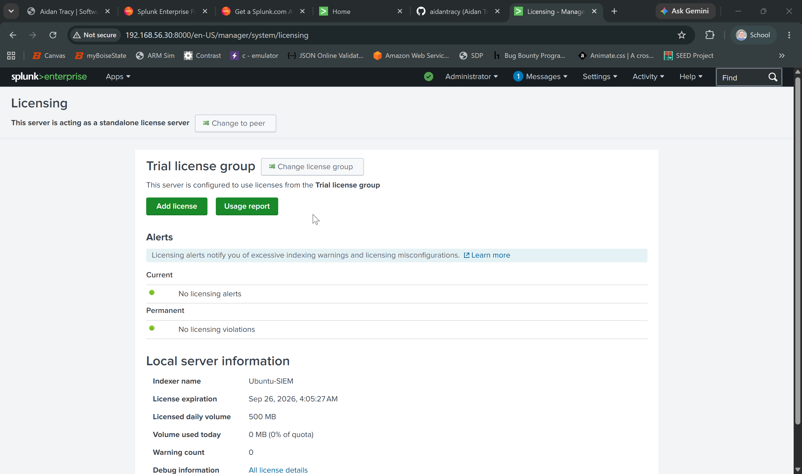
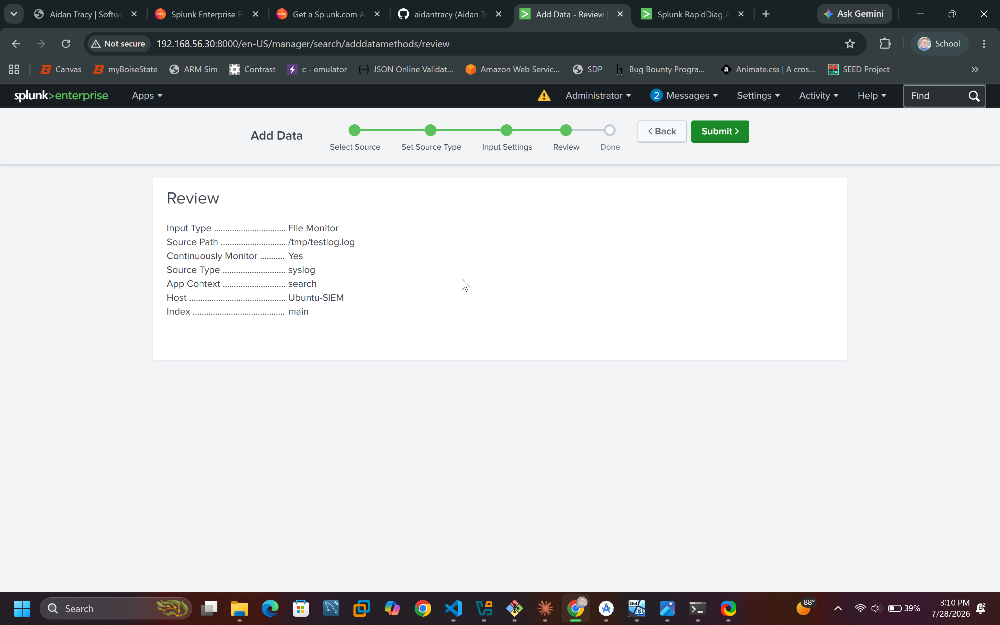
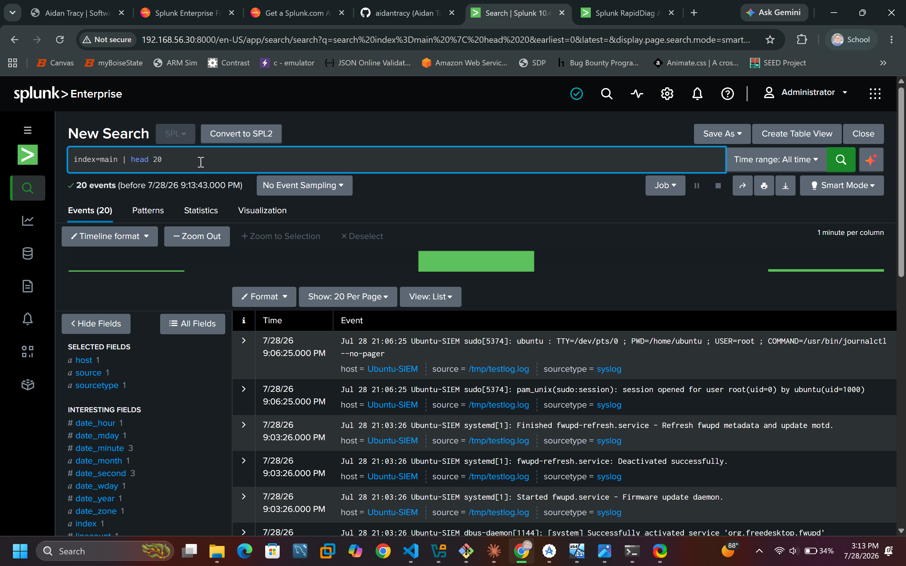
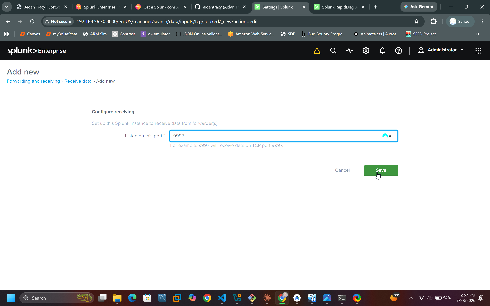

# Lab 01: Standing Up a SIEM with Splunk Free

> Installing Splunk Free on the Ubuntu SIEM host, bringing up Splunk Web, and confirming it's ready to ingest logs — my first working SIEM.

**Domain:** SIEM & Log Analysis
**Tools:** Splunk Free, Ubuntu Server
**MITRE ATT&CK:** N/A (tooling)
**Date:** 07/27/2026

---

## Objective

Install and configure Splunk Enterprise under the **Free license** on my Ubuntu SIEM VM (192.168.56.30), verify Splunk Web loads, and prepare it to receive logs from the Windows endpoint in the next lab. By the end I have a running SIEM I can search.

## Why Splunk Free for a lab

Splunk Free lets me index **up to 500 MB of data per day** — far more than a small lab generates — at no cost, with almost all Splunk Enterprise search and dashboard features intact. The trade-offs are fine for a lab: **no login/authentication** (you're dropped straight in as admin), and **no alerting or user roles**. When I reach the detection labs and want real alerting, I can switch to a **free 60-day Enterprise trial** on the same install. For now, Free is the right tool to learn SPL and build dashboards.

## Environment

- SIEM host: Ubuntu Server, 192.168.56.30 (from Lab 00)
- Access from host browser over the host-only network


## Step 1 — Get the Splunk installer

Splunk requires a free account to download. Two ways to get the `.deb` onto the Ubuntu VM:

- Download the **Linux .deb** from splunk.com on your host, then copy it to the VM (shared folder or `scp`), **or**
- Temporarily attach a NAT adapter to the VM and `wget` the download link Splunk gives you, then remove NAT.


*(Screenshot: the .deb file present on the Ubuntu VM via `ls -lh`.)*

## Step 2 — Install the package

```bash
# from the directory containing the downloaded file
sudo dpkg -i splunk-*-linux-amd64.deb
```

This installs Splunk to `/opt/splunk`.

## Step 3 — First start and accept the license

```bash
sudo /opt/splunk/bin/splunk start --accept-license
```

On first run Splunk will prompt you to create an **administrator username and password** — set these and note them (you'll use them to log into Splunk Web).


*(Screenshot: the "Splunk Web is running" message showing the URL, e.g. `http://<host>:8000`.)*

## Step 4 — Enable boot-start (so it survives reboots)

```bash
sudo /opt/splunk/bin/splunk enable boot-start
```

## Step 5 — Switch to the Free license

By default Splunk starts a 60-day Enterprise trial. To run indefinitely on Free:

1. Open Splunk Web at `http://192.168.56.30:8000` from your host browser and log in.
2. Go to **Settings → Licensing**.
3. Click **Change license group → Free license → Save**, then restart Splunk when prompted:

```bash
sudo /opt/splunk/bin/splunk restart
```

> Keep the Enterprise trial instead if you want to practice **alerting** now — just remember it reverts to a restricted state after 60 days. You can always switch to Free later.


*(Screenshot: Settings → Licensing showing the Free license active.)*

## Step 6 — Confirm it works with a test ingest

Prove the SIEM can index and search data:

1. In Splunk Web: **Settings → Add Data → Upload**.
2. Upload any small local log file (e.g., `/var/log/syslog` copied off the box, or a sample log).
3. Finish the wizard, then go to **Search & Reporting** and run:

```spl
index=main | head 20
```

You should see your events. Try a time-based search and a simple stats command:

```spl
index=main | stats count by sourcetype
```


*(Screenshot: Setting up setting up monitor for temp folder for log ingestion.)*


*(Screenshot: search results showing ingested events — this is your proof the SIEM works.)*


## Step 7 — Open the receiving port for the next lab

To let the Windows endpoint forward logs in Lab 02, enable a receiver:

1. **Settings → Forwarding and receiving → Configure receiving → New Receiving Port**.
2. Add port **9997** (the standard Splunk forwarder port) and save.


*(Screenshot: receiving port 9997 listed as enabled.)*

## Findings / result

| Item | Result |
|------|--------|
| Splunk install | `/opt/splunk`, boot-start enabled |
| Splunk Web | Reachable at `http://192.168.56.30:8000` |
| License | Free (500 MB/day) |
| Test search | Events indexed and searchable in `index=main` |
| Receiver | Port 9997 enabled for forwarders |

A working SIEM, ready to receive endpoint telemetry.

## Lessons learned

This lab was my first time standing up a SIEM from the command line instead of a GUI, and it taught me a lot about how Splunk actually runs on a server. One of the first lessons was choosing to run Splunk under a dedicated non-root service account instead of as root — a small change, but a good security habit and something I can speak to in an interview.

A few practical things stuck with me. Large package installs like Splunk's can sit on "Setting up..." for several minutes, and interrupting them can corrupt the install, so patience matters. A headless Ubuntu server has no clipboard sharing, so SSHing in from my host made pasting commands and the whole workflow far smoother — and it's how real admins work anyway. Configuring the static IP meant editing netplan YAML, where indentation is strict and a single wrong space breaks the config.

Getting logs to ingest also taught me a permissions lesson: because Splunk runs as the `splunk` user, any file I want it to read has to be readable by that user, which is why I had to `chmod` the log file before monitoring it. Finally, I learned the difference between the Free license and the Enterprise trial — Free runs forever but drops alerting and login, so I kept the trial for now since my later detection labs will need alerting. Seeing my first events parsed as syslog and searchable with SPL made the whole collect → index → search pipeline finally click.

## Next lab

**Lab 02 — Windows Log Ingestion:** install Sysmon + a Universal Forwarder on the Windows VM and pipe its security and Sysmon events into this Splunk instance over port 9997.

## References

- About Splunk Free (500 MB/day; no auth, no alerting): https://help.splunk.com/en/splunk-enterprise/administer/admin-manual/10.4/configure-splunk-licenses/about-splunk-free
- Splunk downloads: https://www.splunk.com/en_us/download/splunk-enterprise.html
